# 이어봄(Ieobom)

AI 기반 가족 생활 기록 및 안부 연결 서비스

이어봄은 고령 부모님의 하루를 대화와 기록으로 남기고, AI가 이를 가족이 읽기 쉬운 하루 이야기로 요약해 보호자에게 전달하는 MVP 서비스입니다. 가족은 부모님의 하루를 확인하고 감정 반응과 댓글을 남기며 자연스럽게 안부를 주고받을 수 있습니다.

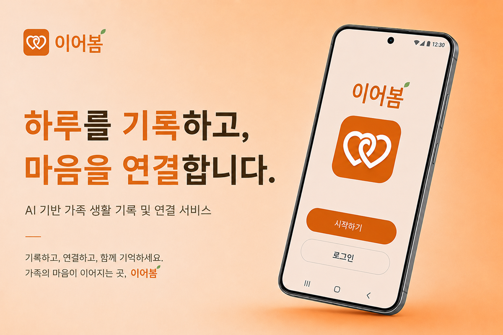

## Links

- [📄 프로젝트 상세](https://app.notion.com/p/AI-f59b22d35981832da3f00125079b4733?source=copy_link)
- [🌐 서비스 배포](https://ieobom.vercel.app/)
- [GitHub](https://github.com/mingyeong-seo/ieobom)
- [발표 영상](https://youtu.be/jP_X3VgaTWQ?si=xg_4_OWkOirWS3gC)
- [회고](https://velog.io/@swmg00/%EC%9D%B4%EC%96%B4%EB%B4%84-%ED%9A%8C%EA%B3%A0)
- API Docs(local): http://localhost:8000/docs

## 프로젝트 개요

| 항목 | 내용 |
| --- | --- |
| 프로젝트명 | 이어봄(Ieobom) |
| 한 줄 소개 | AI가 고령 부모님의 하루를 이야기 형태로 요약하여 보호자에게 전달하는 가족 연결 서비스 |
| 진행 기간 | 2026년 5월 11일 - 2026년 5월 18일 |
| 팀 구성 | FE 2명 / BE 2명 / 기획 1명 |
| 담당 역할 | 프론트엔드 개발, 서비스 기획, 사용자 조사, MVP 설계, BI 디자인 |
| 키워드 | AI, MVP, UI/UX, 사용자 조사, 가족 연결 |

## 문제 정의

아이디어톤 주제인 "AI로 OO을 없앤다면?"에서 해결할 문제를 **가족 간 안부 공백**으로 정의했습니다.

부모님의 안부를 자주 확인하고 싶지만 바쁜 일상, 심리적 부담, 연락 타이밍의 어려움 때문에 꾸준히 연락하지 못하는 상황이 많다고 판단했습니다. 이어봄은 부모님을 감시하거나 대신 판단하는 서비스가 아니라, 부모님의 하루 기록을 가족에게 부드럽게 전달해 대화를 시작할 수 있도록 돕는 서비스로 기획했습니다.

## 사용자 조사

총 41명의 사용자 설문을 통해 문제와 기능 방향을 검증했습니다.

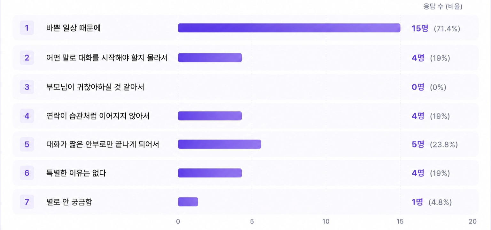

가장 많은 응답자는 부모님과 자주 연락하거나 안부를 확인하기 어려운 이유로 "바쁜 일상 때문에"를 선택했습니다. 이를 통해 연락 의지가 부족해서가 아니라, 일상 속에서 자연스럽게 안부를 확인할 수 있는 연결 장치가 필요하다고 판단했습니다.

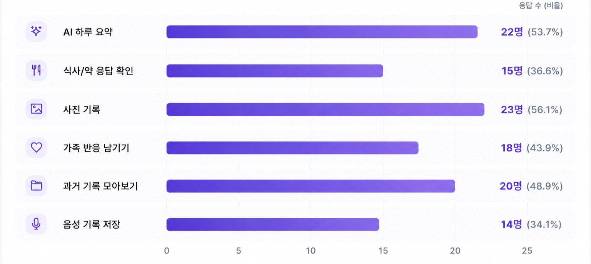

기능 니즈 조사에서는 사진 기록, AI 하루 요약, 과거 기록 조회, 가족 반응 남기기가 높은 응답을 얻었습니다. 이를 바탕으로 MVP의 핵심 기능을 하루 기록, AI 요약, 가족 반응, 과거 기록 조회 중심으로 정리했습니다.

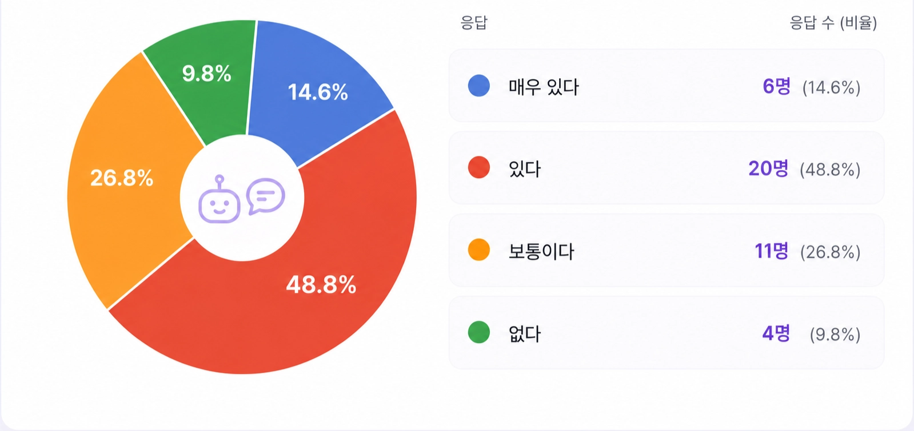

AI가 부모님의 짧은 기록을 하루 이야기 형태로 정리해주는 기능에 대해 긍정 응답이 63.4%로 나타났습니다. 따라서 AI를 판단이나 감시의 도구가 아니라 가족 간 대화를 이어주는 보조 도구로 설계했습니다.

## MVP 핵심 기능

- AI 대화 기반 하루 기록
- AI 하루 이야기 생성
- 보호자용 하루 스토리 조회
- 가족 감정 반응 및 댓글
- 사진 기록
- 과거 기록 조회
- AI 제안 기능
- 역할 기반 부모/보호자 화면 분리

## 서비스 흐름

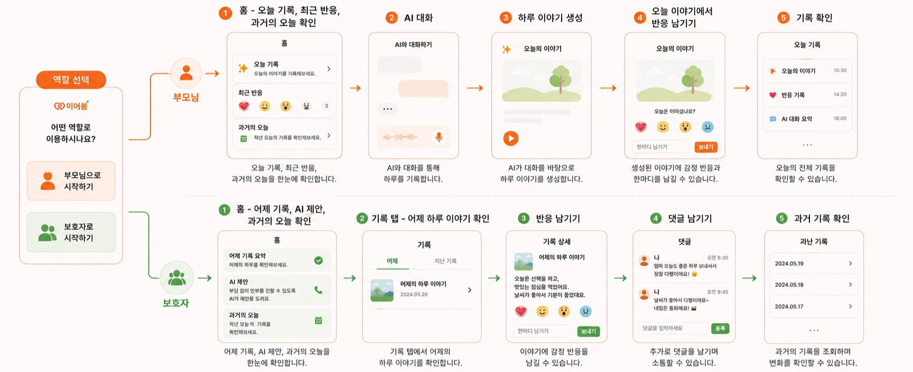

## 담당 역할

### 기획

- 서비스 아이디어 제안
- 서비스명 "이어봄" 제안
- 41명 사용자 설문 조사 기획 및 결과 분석
- MVP 핵심 기능 정의
- 부모/보호자 사용자 흐름 설계
- AI의 역할과 서비스 범위 정의

### 디자인

- 서비스 BI 제작
- 심볼 및 로고 제작
- 컬러 팔레트 정의
- 브랜드 폰트 선정
- 메인 포스터 제작
- 아침/밤 테마 포스터 제작

### 프론트엔드 구현

- 부모 홈 화면 구현
- 부모 AI 대화 화면 구현
- 보호자 홈 화면 구현
- 보호자 설정 화면 구현
- 역할 기반 화면 분기 구현
- FastAPI REST API 연동
- 로딩/에러/fallback 상태 처리
- 고령층 사용성을 고려한 UI/UX 개선

## 담당 화면

<p align="center">
  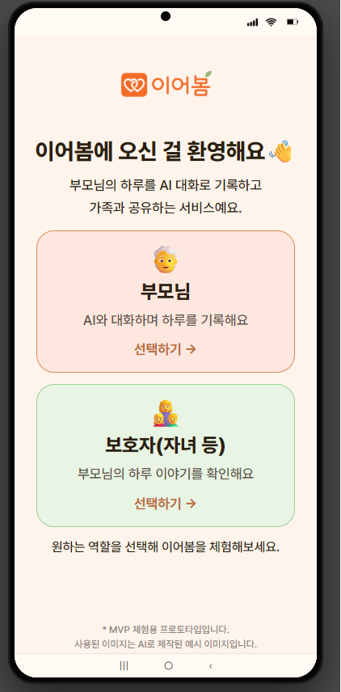
  &nbsp;&nbsp;
  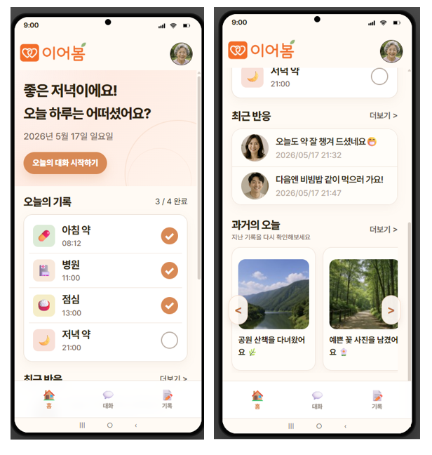
</p>

<p align="center">
  <b>역할 선택</b> · 부모/보호자 역할별 진입 화면<br/>
  <b>부모 홈</b> · 오늘의 기록, 최근 반응, 과거의 오늘 확인
</p>

<p align="center">
  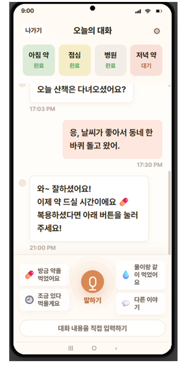
  &nbsp;&nbsp;
  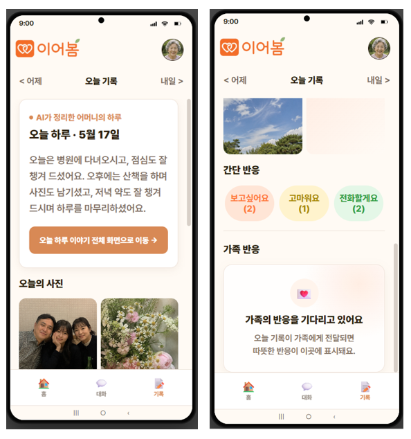
</p>

<p align="center">
  <b>AI 대화</b> · 대화하듯 하루를 기록하는 화면<br/>
  <b>하루 이야기</b> · AI가 생성한 하루 요약 결과 화면
</p>

<p align="center">
  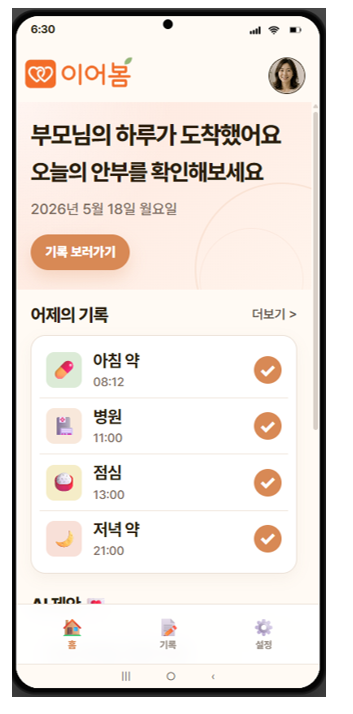
  &nbsp;&nbsp;
  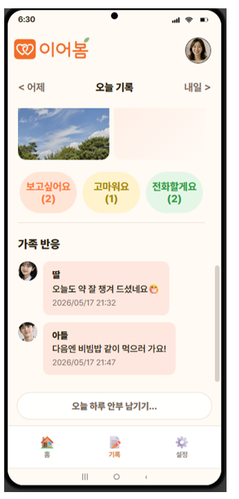
</p>

<p align="center">
  <b>보호자 홈</b> · 부모님의 하루 기록과 AI 제안 확인<br/>
  <b>가족 반응</b> · 감정 반응과 댓글을 통한 안부 연결
</p>
## 주요 구현 내용

### 1. 역할별 기능은 분리하되 공통 패턴을 유지한 UI 설계

부모님과 보호자는 서비스를 사용하는 목적이 다르기 때문에 필요한 정보와 기능이 달랐습니다. 하지만 하나의 가족 연결 서비스라는 일관성을 유지하기 위해 공통 레이아웃과 디자인 패턴은 유지하고, 역할별로 필요한 정보만 다르게 배치했습니다.

- 부모 홈: 오늘의 기록, 최근 반응, 과거의 오늘
- 보호자 홈: 어제 기록, AI 제안, 과거의 오늘
- 공통 패턴: 카드 UI, 하단 탭, 큰 글씨, 명확한 CTA

### 2. FastAPI REST API 연동을 통한 사용자 흐름 구현

React에서 FastAPI와 통신하기 위한 Fetch API 기반 REST API 통신 흐름을 구현했습니다.

- `VITE_API_BASE_URL` 환경변수로 로컬/배포 API 주소 분리
- JWT 토큰을 Authorization 헤더에 포함해 인증 요청 처리
- 앱 초기 진입 시 사용자 정보, 오늘의 대화 세션, 최신 하루 이야기 조회
- 부모님의 대화 응답 저장 후 상태값에 따라 하루 이야기 생성 API 호출
- 생성된 하루 이야기 데이터를 화면에 반영
- API 요청 중 로딩, 에러, fallback 상태를 관리해 화면 흐름이 끊기지 않도록 처리

#### API 연동 흐름

```text
1. /api/v1/demo/bootstrap
   - 부모님/보호자 데모 토큰 및 가족 데이터 조회

2. /api/v1/checkin/sessions/today
   - 오늘의 대화 세션 조회

3. /api/v1/conversation/sessions/{session_id}/messages
   - 부모님 대화 응답 저장

4. /api/v1/stories/sessions/{session_id}/generate
   - 대화와 루틴 기반 하루 스토리 생성

5. /api/v1/stories/latest
   - 최신 스토리 조회

6. /api/v1/reactions/stories/{story_id}
   - 감정 반응 및 댓글 조회/등록
```

### 3. 고령층 사용성을 고려한 UI/UX 개선

1차 MVP 구현 후 팀 내부 리뷰를 반영해 고령층 사용자가 핵심 정보를 더 쉽게 인지할 수 있도록 화면을 개선했습니다.

- 역할 선택 화면을 카드형 UI로 재구성
- 홈 화면 정보 우선순위 재배치
- 대화 화면의 버튼 크기, 메시지 간격, 입력 영역 개선
- 기록 화면의 카드 크기, 텍스트 계층, CTA 강조
- CSS에서 font-size, padding, gap, border-radius, 색상 대비 조정

## 기술 스택

<p>
  
  
  
  
  
  
  
</p>

## 프로젝트 구조

```text
ieobom
├─ frontend
│  ├─ src
│  ├─ public
│  └─ package.json
├─ backend
│  ├─ app
│  ├─ tests
│  └─ requirements.txt
└─ README.md
```

## 로컬 실행 방법

### Backend

```bash
cd backend
python -m venv .venv
.venv\Scripts\activate
pip install -r requirements.txt
copy .env.example .env
uvicorn app.main:app --reload
```

`.env` 파일에서 OpenAI API Key 등 필요한 환경 변수를 설정합니다.

### Frontend

```bash
cd frontend
npm install
npm run dev
```

## 검증 명령어

### Frontend

```bash
cd frontend
npm run lint
npm run build
```

### Backend

```bash
cd backend
pytest
```

## 프로젝트를 통해 배운 점

이번 프로젝트를 통해 기능 구현보다 먼저 사용자의 문제를 정의하고 검증하는 과정이 서비스 설계의 출발점이라는 점을 배웠습니다.

설문 결과를 바탕으로 MVP 범위를 정하면서 모든 기능을 구현하기보다 핵심 가설을 검증할 수 있는 기능을 우선 구현하는 방식을 경험했습니다. 또한 AI 기능을 많이 추가하는 것보다, 사용자가 부담 없이 받아들일 수 있도록 AI의 역할을 명확하게 제한하는 것이 중요하다는 점을 배웠습니다.

1차 구현 이후 팀 내부 리뷰를 반영해 UI를 개선하면서, 구현이 끝난 뒤에도 사용자 피드백을 바탕으로 서비스를 계속 다듬는 과정이 중요하다는 점도 확인했습니다.

## 관련 회고

- [이어봄 회고: AI보다 먼저 이해해야 했던 것은 사용자의 문제였다](https://velog.io/@swmg00/%EC%9D%B4%EC%96%B4%EB%B4%84-%ED%9A%8C%EA%B3%A0)
